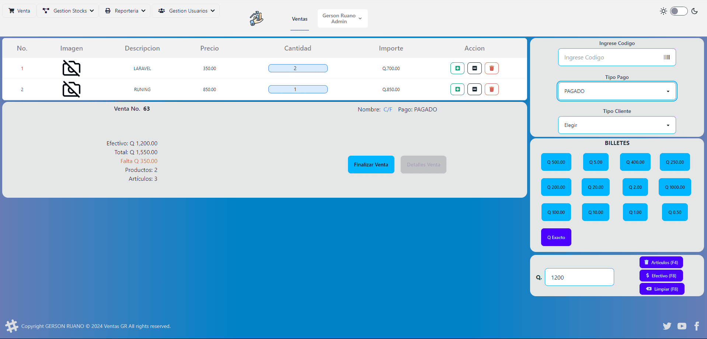
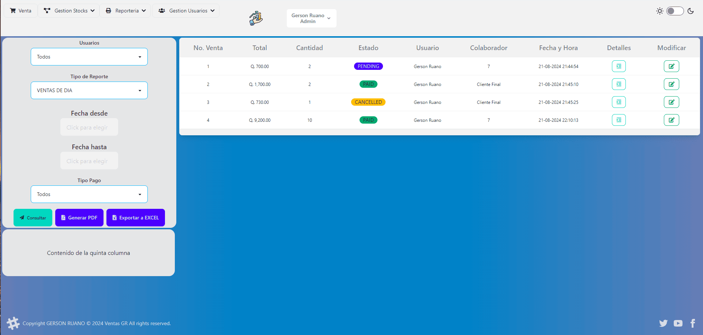
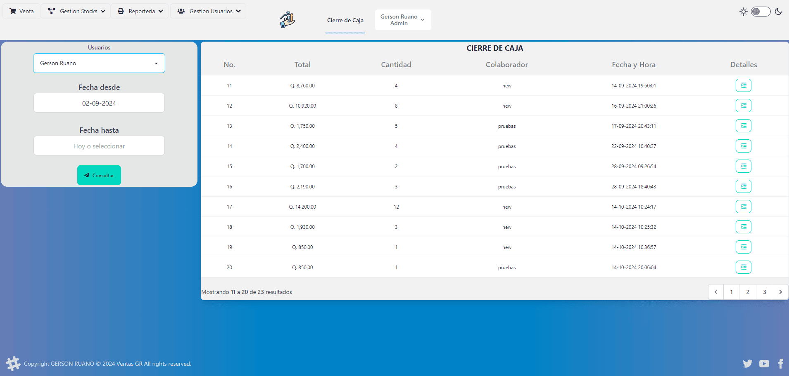

# VENTASGR 

Sistema de ventas, gestion de productos, usuarios, reportes.

<!--img src="https://user-images.githubusercontent.com/104822099/208479821-d38db6ea-2844-4b13-8af0-58ace8636889.png" width="500" heigh="288px" alt="Mi portfolio personal"-->
## Modulo de Ventas

## Modulo de Reportes

## Modulo de Cierre de Caja


## Descripción

Aplicación que permite gestionar productos y ventas de los mismos, administracion de roles y permisos de usuarios para ingreso al sistema asi como compras de productos existentes, visualizaciòn de dashboard.

### Instalación

```
# Clona y accede al repositorio
$ git clone https://github.com/gerson-ruano/ventasgr.git
$ cd ventasgr

# Instala las dependencias
$ composer install
$ npm install

# Genera la base de datos (Configura las credencias en el archivo .env)
$ php artisan migrate

# Genera una llave para la aplicación
$ php artisan key:generate

# Inicia el servidor
$ npm run dev
$ npm run build
```

### Tecnologías empleadas

**Laravel** he utilizado Laravel 9-11 ya que me ha permitido crear fácilmente la estructura básica del proyecto haciendo uso de sus librerías, paquetes y herramientas. 
**Tailwind** para el diseño de los estilos del proyecto
**Daisy Ui** para utilizar componentes prediseñados de tailwind
**livewire** para crear componentes personalizados: para la reactividad de la pagina
**Breeze** para la autenticación de los usuarios.
**Fontawesome** para iconos del sistema.
**SweetAlert2** para notificaciones.

## Documentación

* [Laravel-Docs](https://laravel.com/docs/11.x)


<p align="center"><a href="https://laravel.com" target="_blank"></a></p>

<p align="center">
<a href="https://github.com/laravel/framework/actions"></a>
<a href="https://packagist.org/packages/laravel/framework"></a>
<a href="https://packagist.org/packages/laravel/framework"></a>
<a href="https://packagist.org/packages/laravel/framework"></a>
</p>

## License

The Laravel framework is open-sourced software licensed under the [MIT license](https://opensource.org/licenses/MIT).
